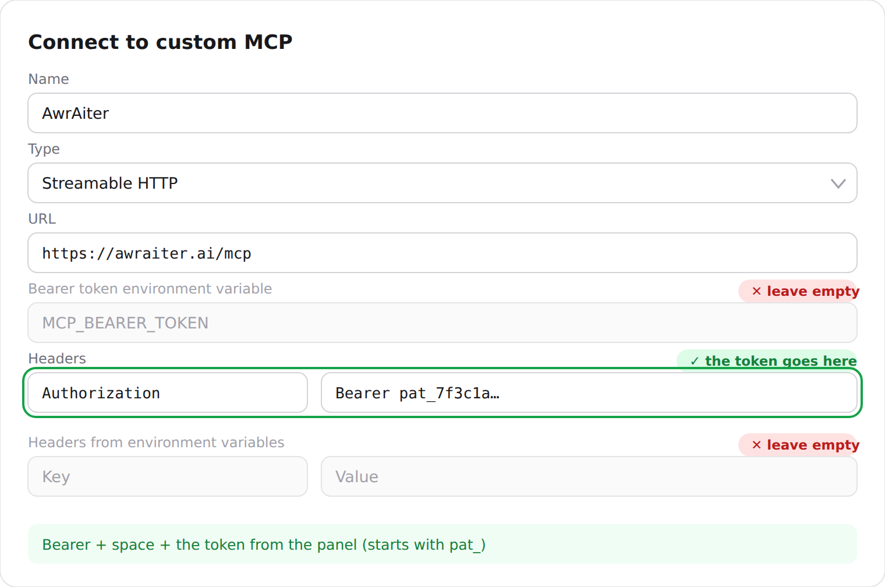

# Connect your Telegram channels to ChatGPT & Claude — AwrAIter MCP guide

AwrAIter ships a built-in [MCP](https://modelcontextprotocol.io) (Model Context Protocol) server. Once connected, your AI assistant can — from inside its own chat window:

- read your channel **statistics** (growth, reach, ER, per-post performance),
- **draft posts** from your channel's fresh scraped sources, in your channel's tone,
- **schedule and publish** posts, or cancel scheduled ones,
- build and fill **content plans**,
- score a draft against what historically works for *your* audience before publishing.

It works on **every plan, including the free one**. The assistant only ever sees the channels of the team you authorize, and its writes go through the same permission checks as the panel.

**Connector URL (the same for every client):**

```
https://awraiter.ai/mcp
```

[Русская версия](connect.ru.md) · [Tool reference](tools.md) · [← back to the README](../README.md)

---

## Claude (web / desktop, paid plan)

1. Open **Settings → Connectors**.
2. Press **Add custom connector** and paste `https://awraiter.ai/mcp`.
3. Press **Connect** — an AwrAIter page opens; sign in with Telegram and confirm access for the team you want.
4. Back in the chat, the AwrAIter tools appear in the tool list. Try:
   > *Show last week's statistics for my channel.*

## Claude Code (CLI)

```bash
claude mcp add --transport http awraiter https://awraiter.ai/mcp
```

Claude Code will walk you through the OAuth sign-in on first use. Alternatively use a personal access token (below):

```bash
claude mcp add --transport http awraiter https://awraiter.ai/mcp \
  --header "Authorization: Bearer YOUR_TOKEN"
```

## ChatGPT (paid plan with connector support)

**Option A — chatgpt.com in the browser, where OAuth is offered:**

AwrAIter is not in the ChatGPT plugin catalog yet, so it is added as your own MCP server:

1. Turn on Developer mode: **Settings → Security and login → Developer mode**.
2. Open **chatgpt.com/plugins** and press **+**. Name — `AwrAiter`, connection — public endpoint, URL `https://awraiter.ai/mcp`, authentication **OAuth**.
3. Press **Connect** and confirm access on the AwrAIter page that opens.
4. In a new chat, add AwrAIter from the tools menu.

**Option B — the ChatGPT / Codex app, "Connect to custom MCP" form.**
That form has no OAuth choice — only a URL, a Bearer token field and headers. Connect with a token:

1. In the panel open **[MCP connection](https://awraiter.ai/mcp-connect)** and press **Create token**.
   Pick *Full access* if the assistant may publish, *Read only* if it should just read analytics.
   The token is shown once — copy it straight away.
2. In the client form: **Name** — anything (e.g. `AwrAiter`), **Type** — **Streamable HTTP**,
   **URL** — `https://awraiter.ai/mcp`.
3. Under **Headers** add the key `Authorization` with the value `Bearer YOUR_TOKEN` —
   the word `Bearer`, a space, then the token itself (it starts with `pat_`).
4. Leave the **Bearer token environment variable** field and the **Headers from environment
   variables** block empty: they expect the *name* of an environment variable on your machine,
   not the token. Putting the token there leaves the connector unauthorized — it will show up
   in the client with no tools at all.
5. Save. The token is bound to the team that was active when you created it.



**If the app won't connect, fall back to Option A.** The custom-MCP form differs between app
builds, and a connector that refuses to come up there usually works on the first try at
chatgpt.com — OAuth signs you in and no token is involved at all. Nothing is lost by switching:
both routes reach the same server with the same tools.

## Gemini CLI, Qwen Code, other MCP clients

The consumer Gemini/Qwen apps don't expose remote MCP servers yet — use their CLI agents or any MCP-capable client and point it at the same URL. Example for Gemini CLI (`~/.gemini/settings.json`):

```json
{
  "mcpServers": {
    "awraiter": {
      "httpUrl": "https://awraiter.ai/mcp",
      "headers": { "Authorization": "Bearer YOUR_TOKEN" }
    }
  }
}
```

## Personal access tokens (for clients without OAuth)

If your client can't do OAuth, mint a token yourself — no need to write to support:

1. In the panel open **[awraiter.ai/mcp-connect](https://awraiter.ai/mcp-connect)**.
2. Create a token and pick a scope:
   - **read-only** — analytics and content can be read, nothing can be published or changed;
   - **full** — the assistant can also draft, schedule, publish and edit channel memory.
3. Pass it as a header on every request: `Authorization: Bearer YOUR_TOKEN`.

The token is shown once at creation; you can see last-used time and revoke any token on the same page. A read-only token is pinned to the team it was minted in.

---

## What the assistant can do — all 25 tools

Tools marked ✍️ change something and need OAuth or a *full*-scope token; a `read` token cannot even see them. Everything else is read-only and works with any scope. `deep_analyze` is marked ✍️ because it spends the team's AI credits — every other tool is free.

The full reference, with the exact scope each tool needs, is in **[tools.md](tools.md)**.

### Teams & channels

| Tool | What it does |
|---|---|
| `list_teams` | List your teams; marks the active one. |
| `switch_team` ✍️ | Switch the active team. |
| `list_channels` | List the active team's channels. |
| `get_channel` | One channel's profile (name, language, description). |

### Analytics & insights

| Tool | What it does |
|---|---|
| `get_channel_stats` | The analytics dashboard: subscribers, reach, ER, dynamics over 1–90 days. |
| `get_channel_insights` | What works for this audience: top/flop posts scored vs the 30-day median, plus statistically-backed patterns (best day, posting window, length, question-at-the-end) once the channel has 20+ scored posts. |
| `deep_analyze` ✍️ | Deep AI analysis of one channel or a comparison of several — runs on AwrAIter's servers, spends AI credits. |
| `get_recent_posts` | Latest published posts of a channel. |
| `search_channel_content` | Semantic search over the channel's own past posts and sources. |

### Writing & publishing ✍️

| Tool | What it does |
|---|---|
| `draft_from_sources` | Freshest scraped sources not yet used in a post — raw material to draft from. |
| `search_sources` | Search the channel's bound sources. |
| `create_post_from_text` ✍️ | Save a ready post (your assistant's text, plus images/videos by URL) as a draft. |
| `preview_post` | Exact preview of what will be sent — title, body, media. |
| `score_post` | Score a draft against the channel's history before publishing. |
| `check_uniqueness` | Near-duplicate check against the team's posts and sources. |
| `schedule_post` ✍️ | Publish a draft now or at a set time. |
| `cancel_scheduled_post` ✍️ | Roll back a scheduled post. |

### Content plans ✍️

| Tool | What it does |
|---|---|
| `get_content_plan` | The channel's plan and its slots. |
| `find_free_slot` | Earliest free slot in the plan. |
| `create_content_plan` ✍️ | Create a content plan for a channel. |
| `get_playbook` | Step-by-step operator playbook for a workflow (analyze / create_plan / fill / improve / rewrite). |

### Channel memory ✍️

| Tool | What it does |
|---|---|
| `get_channel_memory` | The channel's brand brief and banlist. |
| `set_brand_brief` ✍️ | Set free-form brand/tone guidance the AI follows. |
| `add_banlist_entry` ✍️ / `remove_banlist_entry` ✍️ | Maintain the channel's forbidden-words list. |

---

## Things to try

> *Compare my three channels over the last 30 days and tell me which content works best where.*

> *Take the freshest unused source for @mychannel, write a post in the channel's tone, score it, and if the score is good — schedule it for the next free slot.*

> *What are the statistically best day and time to post on my channel?*

> *Build a content plan for next week: 5 posts, alternating news and evergreen topics.*

## Troubleshooting

- **The client keeps saying it's not authorized** — remove the connector and add it again; clients cache the first authorization response.
- **"Channel not ready" on publish** — the service admin isn't in the channel yet; open the channel card in the panel and press *Refresh state*.
- **Rate limits** — the endpoint allows 120 requests per 60 s per token; agents in a tight loop should back off.
- Anything else: [awraiter.ai/support](https://awraiter.ai/support/).

## How this differs from the "userbot" Telegram MCP servers

Most Telegram MCP servers you'll find are MTProto userbots: you hand them your phone
number, log in, and they act **as you** — with access to every private chat you have.
AwrAIter is not one of those.

| | Userbot MCP servers | AwrAIter |
|---|---|---|
| What you hand over | Phone number, login code, a session file that is your account | A Telegram sign-in on our site, or a token you can revoke |
| What it can reach | Everything your account can — DMs, groups, secret material | Only the channels of the team you authorized |
| Risk to your account | The session file is your account; leaking it is a full takeover | No session of yours exists anywhere |
| Ban exposure | Automation from a personal account can get it limited or banned | Publishing goes through a service account, not yours |
| Statistics | Whatever it can scrape from the outside | The channel's own numbers, kept per post since the day it was added |
| Publishing | Sends as you, immediately | Schedules through Telegram itself, with a preview and post-publish verification |

## FAQ

**Do I have to give it my Telegram password, phone number or a session file?**
No. You sign in with the official Telegram login widget on our site — the same one used
for Telegram Login on any website — and authorize the connector over OAuth. There is no
password to give: the panel has none.

**Can it read my private chats?**
No. It has no access to your account at all. It works on channels where you are an
administrator and which you have added to a team in the panel.

**Who publishes the posts, then?**
A service account you add as an administrator to your own channel. You can remove that
admin at any moment and publishing stops; nothing else about your account is touched.

**Does it cost anything to use over MCP?**
The connector is included on every plan, the free one included. The only metered tool is
`deep_analyze`, which spends AI credits because it runs a frontier model over your data.
Everything else — statistics, drafting, planning, publishing — costs nothing extra.

**Can I limit what the assistant is allowed to do?**
Yes. Personal access tokens come in two scopes: read-only (analytics only) and full. A
read-only token cannot publish, schedule or edit anything.

**Which clients work?**
Anything that speaks MCP over Streamable HTTP: Claude (web, desktop, Code), ChatGPT and
Codex, Cursor, Gemini CLI, Qwen Code, and any custom agent. Clients without OAuth use a
personal access token — see above.

Full page with all of this: [awraiter.ai/mcp-server](https://awraiter.ai/mcp-server/)
