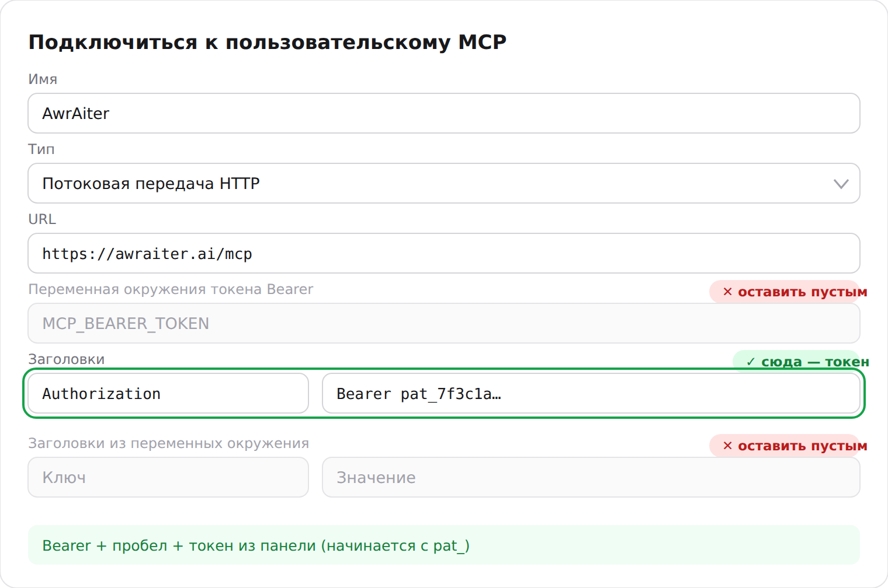

# Подключаем Telegram-каналы к ChatGPT и Claude — гайд по MCP в AwrAIter

В AwrAIter встроен [MCP](https://modelcontextprotocol.io)-сервер (Model Context Protocol). После подключения ваш AI-ассистент — прямо из своего чата — может:

- читать **статистику** каналов (рост, охваты, ER, показатели постов),
- **писать посты** из свежих источников канала и в его тоне,
- **планировать и публиковать** посты, отменять запланированные,
- строить и заполнять **контент-планы**,
- перед публикацией скорить черновик против того, что исторически работает у *вашей* аудитории.

Работает на **любом тарифе, включая бесплатный**. Ассистент видит только каналы той команды, доступ к которой вы выдали, а все изменения проходят те же проверки прав, что и в панели.

**URL коннектора (один для всех клиентов):**

```
https://awraiter.ai/mcp
```

[English version](connect.md) · [Справочник инструментов](tools.ru.md) · [← к README](../README.ru.md)

---

## Claude (веб / десктоп, платный план)

1. Откройте **Settings → Connectors**.
2. Нажмите **Add custom connector** и вставьте `https://awraiter.ai/mcp`.
3. Нажмите **Connect** — откроется страница AwrAIter; войдите через Telegram и подтвердите доступ для нужной команды.
4. Вернитесь в чат — инструменты AwrAIter появились в списке. Попробуйте:
   > «Покажи статистику моего канала за прошлую неделю».

## Claude Code (CLI)

```bash
claude mcp add --transport http awraiter https://awraiter.ai/mcp
```

При первом использовании Claude Code сам проведёт через OAuth-вход. Либо используйте персональный токен (ниже):

```bash
claude mcp add --transport http awraiter https://awraiter.ai/mcp \
  --header "Authorization: Bearer ВАШ_ТОКЕН"
```

## ChatGPT (платный план с поддержкой коннекторов)

**Вариант А — веб-версия chatgpt.com, где есть выбор OAuth:**

В каталоге плагинов ChatGPT AwrAIter пока нет, поэтому он добавляется как свой MCP-сервер:

1. Включите режим разработчика: **Settings → Security and login → Developer mode**.
2. Откройте **chatgpt.com/plugins** и нажмите **+**. Название — `AwrAiter`, подключение — публичный адрес, URL `https://awraiter.ai/mcp`, авторизация **OAuth**.
3. Нажмите **Connect** и подтвердите доступ на открывшейся странице AwrAIter.
4. В новом чате добавьте AwrAIter из меню инструментов.

**Вариант Б — приложение ChatGPT / Codex, форма «Подключиться к пользовательскому MCP».**
В ней выбора OAuth нет — только адрес, поле Bearer-токена и заголовки. Подключаемся токеном:

1. В панели откройте **[Подключение к ИИ](https://awraiter.ai/mcp-connect)** и нажмите **Создать токен**.
   Скоуп *Полный доступ* — если ассистенту можно публиковать, *Только чтение* — если нужна одна аналитика.
   Токен показывается один раз, скопируйте сразу.
2. В форме клиента: **Имя** — любое (например `AwrAiter`), **Тип** — **Потоковая передача HTTP**
   (Streamable HTTP), **URL** — `https://awraiter.ai/mcp`.
3. В блоке **Заголовки** добавьте ключ `Authorization` со значением `Bearer ВАШ_ТОКЕН` —
   слово `Bearer`, пробел, затем сам токен (он начинается с `pat_`).
4. Поле **Переменная окружения токена Bearer** и блок **Заголовки из переменных окружения**
   оставьте пустыми: туда вписывают не токен, а *имя* переменной окружения на вашем компьютере.
   Токен, вставленный туда, никуда не уходит — коннектор остаётся неавторизованным
   и показывает нулевой список инструментов.
5. Сохраните. Токен работает для той команды, которая была активной в момент создания.



**Не подключается в приложении — переходите к варианту А.** Форма кастомного MCP заметно
отличается от сборки к сборке, и коннектор, который там не поднимается, обычно встаёт с первого
раза на chatgpt.com: вход идёт через OAuth, токен не нужен вовсе. Терять нечего — оба пути ведут
на один и тот же сервер с одним и тем же набором инструментов.

## Gemini CLI, Qwen Code и другие MCP-клиенты

Потребительские приложения Gemini/Qwen пока не умеют удалённые MCP-серверы — используйте их CLI-агентов или любой MCP-совместимый клиент с тем же URL. Пример для Gemini CLI (`~/.gemini/settings.json`):

```json
{
  "mcpServers": {
    "awraiter": {
      "httpUrl": "https://awraiter.ai/mcp",
      "headers": { "Authorization": "Bearer ВАШ_ТОКЕН" }
    }
  }
}
```

## Персональные токены (для клиентов без OAuth)

Если клиент не умеет OAuth — выпустите токен сами, писать в поддержку не нужно:

1. В панели откройте **[awraiter.ai/mcp-connect](https://awraiter.ai/mcp-connect)**.
2. Создайте токен и выберите скоуп:
   - **read-only** — можно читать аналитику и контент, публиковать и менять ничего нельзя;
   - **full** — ассистент может также писать, планировать, публиковать и вести память канала.
3. Передавайте его заголовком в каждом запросе: `Authorization: Bearer ВАШ_ТОКЕН`.

Токен показывается один раз при создании; на той же странице видно время последнего использования, там же токен отзывается. Read-only-токен привязан к команде, в которой выпущен.

---

## Что умеет ассистент — все 25 инструментов

Помеченные ✍️ что-то меняют и требуют OAuth либо токен со скоупом *full* — токену `read` они даже не видны. Остальные только читают и работают с любым скоупом. `deep_analyze` помечен ✍️ потому, что тратит AI-кредиты команды; все прочие инструменты бесплатны.

Полный справочник с точным скоупом на каждый инструмент — в **[tools.ru.md](tools.ru.md)**.

### Команды и каналы

| Инструмент | Что делает |
|---|---|
| `list_teams` | Список ваших команд с пометкой активной. |
| `switch_team` ✍️ | Переключить активную команду. |
| `list_channels` | Каналы активной команды. |
| `get_channel` | Профиль канала (имя, язык, описание). |

### Аналитика и инсайты

| Инструмент | Что делает |
|---|---|
| `get_channel_stats` | Дашборд аналитики: подписчики, охваты, ER, динамика за 1–90 дней. |
| `get_channel_insights` | Что работает у этой аудитории: топ/флоп посты со скором против 30-дневной медианы плюс статистические закономерности (лучший день, время, длина, вопрос в конце) при 20+ оценённых постах. |
| `deep_analyze` ✍️ | Глубокий AI-анализ канала или сравнение нескольких — считается на серверах AwrAIter, тратит AI-кредиты. |
| `get_recent_posts` | Последние опубликованные посты канала. |
| `search_channel_content` | Семантический поиск по своим постам и источникам канала. |

### Написание и публикация ✍️

| Инструмент | Что делает |
|---|---|
| `draft_from_sources` | Свежайшие ещё не использованные источники — материал для поста. |
| `search_sources` | Поиск по привязанным источникам канала. |
| `create_post_from_text` ✍️ | Сохранить готовый пост (текст ассистента + фото/видео по URL) как черновик. |
| `preview_post` | Точный предпросмотр того, что уйдёт в канал, — заголовок, текст, медиа. |
| `score_post` | Скор черновика против истории канала до публикации. |
| `check_uniqueness` | Проверка на почти-дубликат постов команды и источников. |
| `schedule_post` ✍️ | Опубликовать черновик сейчас или в заданное время. |
| `cancel_scheduled_post` ✍️ | Откатить запланированный пост. |

### Контент-планы ✍️

| Инструмент | Что делает |
|---|---|
| `get_content_plan` | План канала и его слоты. |
| `find_free_slot` | Ближайший свободный слот в плане. |
| `create_content_plan` ✍️ | Создать контент-план для канала. |
| `get_playbook` | Пошаговый плейбук оператора (analyze / create_plan / fill / improve / rewrite). |

### Память канала ✍️

| Инструмент | Что делает |
|---|---|
| `get_channel_memory` | Бренд-бриф и бан-лист канала. |
| `set_brand_brief` ✍️ | Задать свободный бриф по бренду/тону, которому следует AI. |
| `add_banlist_entry` ✍️ / `remove_banlist_entry` ✍️ | Вести список запрещённых слов канала. |

---

## Что попробовать

> «Сравни три моих канала за 30 дней и скажи, какой контент где работает лучше».

> «Возьми свежайший неиспользованный источник для @mychannel, напиши пост в тоне канала, заскорь его, и если скор хороший — поставь в ближайший свободный слот».

> «Какие день и время публикации статистически лучшие для моего канала?»

> «Собери контент-план на следующую неделю: 5 постов, чередуй новости и вечнозелёные темы».

## Если что-то не работает

- **Клиент твердит, что не авторизован** — удалите коннектор и добавьте заново: клиенты кэшируют первый ответ авторизации.
- **«Канал не готов» при публикации** — сервисный админ ещё не в канале; откройте карточку канала в панели и нажмите «Обновить состояние».
- **Лимиты** — эндпоинт допускает 120 запросов за 60 секунд на токен; агентам в цикле нужен бэкофф.
- Остальное: [awraiter.ai/ru/support](https://awraiter.ai/ru/support/).

## Чем это отличается от юзербот-серверов Telegram

Почти все Telegram-MCP-серверы, которые попадаются в поиске, — это юзерботы на MTProto:
вы отдаёте им номер телефона, входите, и дальше они действуют **от вашего имени**, имея
доступ ко всей вашей переписке. AwrAIter устроен иначе.

| | Юзербот-серверы | AwrAIter |
|---|---|---|
| Что вы отдаёте | Номер, код входа и session-файл, который и есть ваш аккаунт | Вход через Telegram на нашем сайте или токен, который можно отозвать |
| Куда достаёт | Всюду, куда достаёт ваш аккаунт: личные чаты, группы, всё | Только каналы той команды, которую вы авторизовали |
| Риск для аккаунта | Session-файл равен аккаунту: утёк — аккаунт чужой | Никакой вашей сессии нигде не существует |
| Риск бана | Автоматизация с личного аккаунта приводит к ограничениям и банам | Публикует сервисный аккаунт, не ваш |
| Статистика | Что удалось снять снаружи | Собственные цифры канала, по каждому посту, с момента подключения |
| Публикация | Отправляет от вас, сразу | Ставит через сам Telegram, с предпросмотром и проверкой после выхода |

## Частые вопросы

**Нужно ли отдавать пароль, номер телефона или session-файл?**
Нет. Вы входите официальным виджетом Telegram на нашем сайте — тем же, что используется
для входа через Telegram на любом сайте, — и подтверждаете коннектор по OAuth. Пароля
отдавать неоткуда: в панели его просто нет.

**Он может читать мою переписку?**
Нет. Доступа к вашему аккаунту у него нет вообще. Он работает с каналами, где вы
администратор и которые вы добавили в команду в панели.

**Кто тогда публикует посты?**
Сервисный аккаунт, которого вы сами делаете администратором своего канала. Снимете
админку — публикация прекратится, больше ничего в вашем аккаунте не затронуто.

**Стоит ли MCP отдельных денег?**
Коннектор входит во все тарифы, включая бесплатный. Единственный платный инструмент —
`deep_analyze`: он тратит AI-кредиты, потому что гоняет фронтир-модель по вашим данным.
Всё остальное — статистика, черновики, планы, публикация — без доплат.

**Можно ограничить, что ассистенту позволено?**
Да. У персональных токенов два скоупа: read-only (только аналитика) и full. Токен
read-only не опубликует, не запланирует и не отредактирует ничего.

**Какие клиенты поддерживаются?**
Любые, кто умеет MCP по Streamable HTTP: Claude (веб, десктоп, Code), ChatGPT и Codex,
Cursor, Gemini CLI, Qwen Code, свои агенты. Клиенты без OAuth подключаются персональным
токеном — см. выше.

Отдельная страница со всем этим: [awraiter.ai/ru/mcp-server](https://awraiter.ai/ru/mcp-server/)
